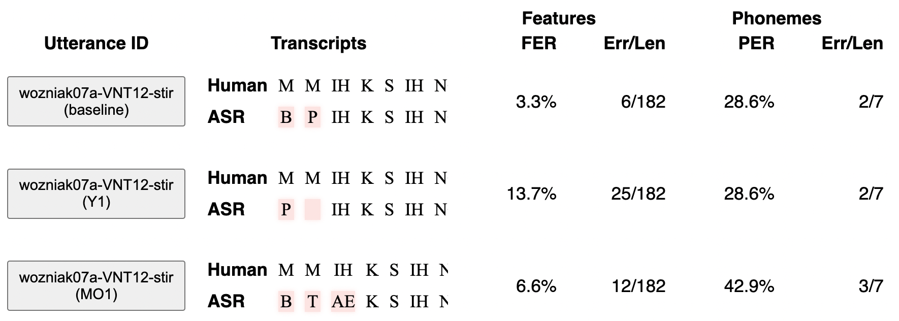
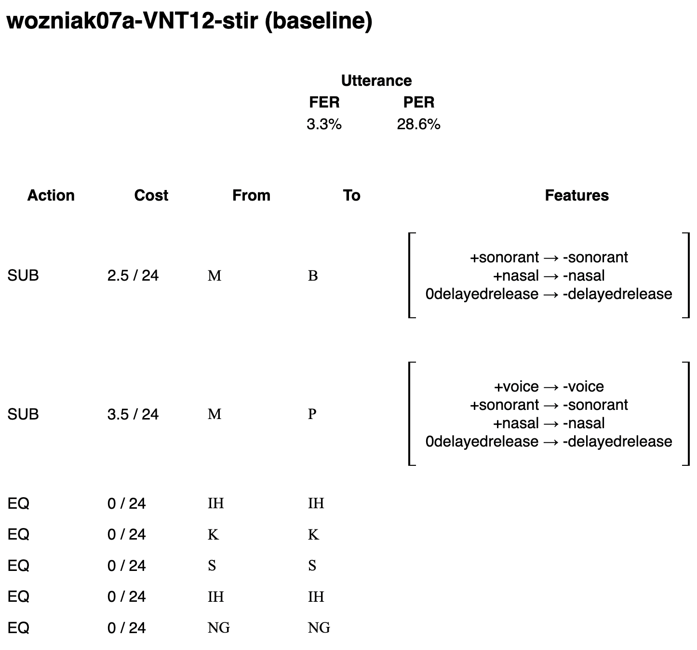

## PhonoLogic Viewer: An (Open-Source) ASR Analysis App

FER provides a more nuanced evaluation for ASR systems, but its complexity makes it difficult to interpret. For the PSST Challenge, we wanted a better way to understand FER. We wanted to know which phonological features were involved to get a sense of how each model struggled. For this reason, we created PhonoLogic Viewer, an open-source, interactive tool for phonemic error analysis.

**Step 1 — Get the app.**

**_MacOS:_**
  1. Download the app from [this location](https://github.com/rcgale/phonologic-viewer/releases/download/0.0.0a0/PhonologicViewer-macos.zip).
  2. Double-click to unzip the file
  3. **Important:** PhonoLogic Viewer is still in an early, unsigned version. The first time you run the app, you'll have to tell MacOS that you trust us. Right-click the app and choose "Open." When you see a warning that says "macOS cannot verify the developer of 'PhonologicViewer'," click "Open" to continue running the program. 

**_Windows:_**
  1. Download the app from [this location](https://github.com/rcgale/phonologic-viewer/releases/download/0.0.0a0/PhonologicViewer-windows.zip).
  2. To unzip the file, right-click and choose "Extract all..."
  3. **Important:** PhonoLogic Viewer is still in an early, unsigned version. The first time you run the app, you'll see a warning that _"Windows has protected your PC."_ To indicate that you trust us, click _"More Info"_, then _"Run anyway."_ 

**Step 2 — Prepare the transcripts.** PhonoLogic Viewer analyzes pairs of phonemic transcripts. We’ll compare transcripts from two different sources: human (from the PALAT team) vs. ASR (from the PSST Challenge). We created an [example file](./example-input-file.csv) for the purposes of this demonstration. Here are a few rows from that file: 

| ID                               | Human            | ASR              |
|----------------------------------|------------------|------------------|
| wozniak07a-VNT12-stir (baseline) | M M IH K S IH NG | B P IH K S IH NG |
| wozniak07a-VNT12-stir (Y1)       | M M IH K S IH NG | P IH K S IH NG   |
 | wozniak07a-VNT12-stir (MO1)      | M M IH K S IH NG | B T AE K S IH NG | 

The first column is an ID we’ll use to refer to the pair of transcripts. The second and third columns are the human and ASR transcripts, respectively. The challenge used ARPAbet, but there’s also (some) support for IPA.

**Step 3 — Process a transcript file.** Switching back to the app, we’ll load a transcripts file. Click the Choose File button, and locate the file from Step 2 (`example-input-file.csv`). Next, you might see a spinner icon with the word “Analyzing…” while PhonoLogic computes all the phonological distances and metrics.

**Step 4 — Explore!** Once PhonoLogic’s analysis is complete, you’ll see a table with a row for each transcript pair in your file. Each row presents an alignment of the two transcripts (with errors highlighted in red) along with the relevant error metrics.

{:width='100%'}

**Step 5 — Even more detail.** Click the button with the Utterance ID to see details about each error, and how FER was computed. We’ll explain this computation in more detail and share some interpretations in light of the data. 

{:width='75%'}
 
